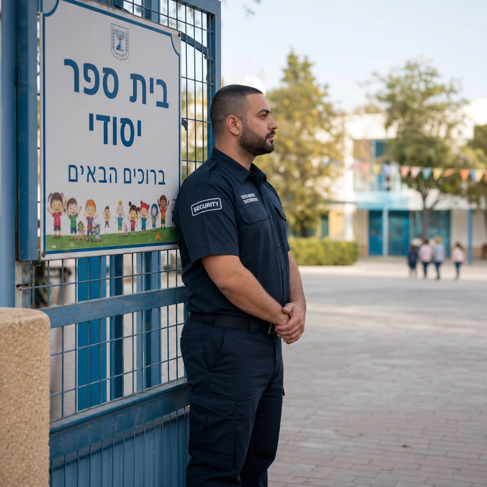
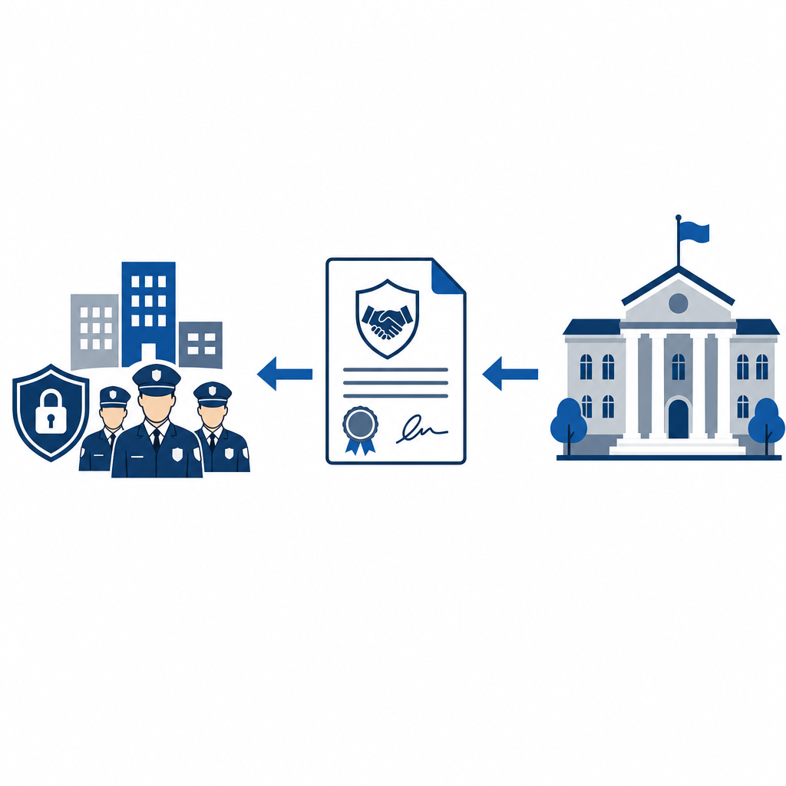

# שמירה ואבטחה דרך משכ"ל: כך החברה למשק וכלכלה מסייעת לרשויות המקומיות

כשרשות מקומית צריכה להציב מאבטח בשער בית ספר, היא לא תמיד יוצאת למכרז משלה. במקרים רבים היא נשענת על גוף ותיק שעובד עבור הרשויות כבר עשרות שנים: החברה למשק וכלכלה של השלטון המקומי, המוכרת בקיצור משכ"ל. תחום הביטחון של משכ"ל הוא אחד הערוצים המרכזיים שדרכם רשויות מקומיות מסדירות שמירה ואבטחה — ובמיוחד את אבטחת מוסדות החינוך.

## מהי החברה למשק וכלכלה (משכ"ל)

משכ"ל היא החברה למשק וכלכלה של השלטון המקומי בע"מ. היא נוסדה באפריל 1974 ופועלת כבר מעל חמישים שנה. הבעלות עליה ציבורית במהותה: מרכז השלטון המקומי בישראל מחזיק 90% ממנה, ומרכז המועצות האזוריות מחזיק את יתרת ה-10%. במילים אחרות, מדובר בחברה שבבעלות ארגוני הרשויות המקומיות עצמן.

הרעיון שעמד מאחורי ההקמה היה פשוט ויעיל: במקום שכל רשות תתמודד לבדה מול שוק הספקים, מספר ראשי רשויות חברו יחד כדי לייסד גוף אחד שיפעל עבור כולן. כך ניתן להשיג יתרון כלכלי משמעותי — כוח קנייה מרוכז וחיסכון בעלויות של עריכת מכרזים נפרדים. משכ"ל מתוארת כיום כזרוע התפעולית המרכזית של השלטון המקומי, והיא פועלת ביותר מ-40 תחומי שירות.

שני תחומי הפעילות המרכזיים שלה הם עריכה ופרסום של מכרזי מסגרת עבור הרשויות, ומתן שירותי ניהול, תיאום ופיקוח לפרויקטים. תמורת שירותיה גובה החברה עמלה מהרשויות.

## איפה יושב תחום הביטחון

עמוד המכרזים הרשמי של משכ"ל מחלק את הפעילות למספר קטגוריות מרכזיות — בהן ביטוח, איכות הסביבה, בנייה ושיפוצים, חינוך, טכנולוגיות ופיתוח תשתיות. אחת מהן היא תחום **הביטחון**, וזהו התחום הרלוונטי לשמירה ואבטחה.

חשוב להבהיר נקודה אחת שמתבלבלים בה לעיתים: ראשי התיבות "פמ"א" אינם מתייחסים ל"פיקוח מנע ואבטחה". פמ"א היא חברת בת של משכ"ל העוסקת בעיקר בשירותי ניהול ופיקוח על פרויקטים, ולא גוף אבטחה ייעודי. השמירה והאבטחה מנוהלות תחת תחום הביטחון של משכ"ל עצמה. בתוך תחום זה נכלל, בין היתר, מכרז למתן שירותי אבטחה ושמירה — השירות המרכזי שעליו נשענות הרשויות.

## מה מחלקת השמירה והאבטחה עושה בפועל

על פי המקורות הרשמיים, פעילות משכ"ל בתחום מתמקדת בכמה צירים מרכזיים.

הציר הראשון הוא **מכרזי מסגרת לשירותי אבטחה ושמירה**. משכ"ל עורכת ומפרסמת מכרז מרכזי שבמסגרתו נבחרים זכיינים — חברות שמירה ואבטחה. רשות מקומית יכולה להצטרף למכרז המסגרת הזה במקום לפרסם מכרז עצמאי משלה.

הציר השני, והבולט ביותר במקורות, הוא **אבטחת מוסדות חינוך**. זהו הליבה של הפעילות בפועל: החברה מעורבת באספקת מאבטחים למוסדות חינוך, ולפי הצורך גם סדרנים.

הציר השלישי הוא **פיקוח ובקרה על זכויות עובדי האבטחה**. כאן משכ"ל מילאה תפקיד משמעותי בהטמעת הסכמים משנת 2016, שהבטיחו רציפות תעסוקתית למאבטחים. אחד ההישגים הבולטים: שכר המאבטחים בחודשי הקיץ, כשמוסדות החינוך סגורים, מחושב לפי ממוצע שעות האבטחה שבוצעו ותוקצבו בפועל — מנגנון ששומר על הביטחון התעסוקתי של המאבטח גם בתקופה שבה אין עבודה שוטפת.

הנתונים שמפרסמת משכ"ל ממחישים את היקף הפיקוח על הזכויות. בשנת 2022 הוחזרו לעובדים כ-402 אלף ש"ח בעקבות תלונות, ועוד כ-614 אלף ש"ח בעקבות בקרות, בממוצע החזר של כ-1,604 ש"ח לעובד. במצטבר, בין השנים 2013 ל-2022, הוחזרו לעובדי אבטחה למעלה מ-19 מיליון ש"ח.

לצד אלה, על פי דיווחים קיימת למשכ"ל גם תשתית להכשרת מאבטחים, ובכלל זה מאבטחי מוסדות חינוך ויישובי ספר.

## איך רשות מקומית מתקשרת דרך משכ"ל

הבסיס לכל המהלך הוא דיני המכרזים. החוק מאפשר לרשות מקומית להתקשר בהסתמך על מכרז שפרסם מוסד ציבורי, מבלי לערוך מכרז עצמאי משלה. משכ"ל היא בדיוק מוסד ציבורי כזה. כאשר היא מפרסמת מכרז מסגרת מרכזי לשירותי אבטחה ושמירה, רשות שמצטרפת אליו פטורה מעריכת מכרז נפרד.

בפועל, רוב הרשויות אינן מסתפקות בהצטרפות למכרז בלבד. הן רוכשות חבילה משולבת: גם את ההצטרפות למכרז המסגרת וגם את שירותי הניהול והפיקוח של משכ"ל, תמורת עמלה. השילוב הזה חוסך לרשות זמן ועלויות, ומאפשר לה להסתמך על תנאי סף ובקרת איכות שכבר נבדקו ברמה הארצית.

כאן טמון אחד היתרונות המשמעותיים של המודל: כוח הקנייה המרוכז של עשרות ומאות רשויות מאפשר תמחור טוב יותר. רשויות קטנות וחלשות, שלא תמיד יכולות לממן מערך אבטחה עצמאי, יכולות להישען על מכרז מסגרת ארצי באיכות אחידה. זהו מענה רלוונטי במיוחד לנוכח האתגרים המוכרים בתחום — פערים בין רשויות חזקות לחלשות, ותחושה מתמשכת אצל ראשי רשויות שמערכי האבטחה במוסדות החינוך אינם מספקים דיים.

## פיקוח והגנה על זכויות עובדים

מעבר לעצם אספקת השמירה, אחד התפקידים שמשכ"ל לקחה על עצמה הוא לוודא שהמאבטחים עצמם מקבלים את שמגיע להם. החברה מנהלת פיקוח וביקורת על יישום ההסכמים הנוגעים לרציפות העסקת המאבטחים, והרשויות המקומיות נדרשות מצידן לבצע בקרה על יישום ההסכמות בפועל.

חשוב להזכיר גם את חלוקת האחריות הרחבה יותר באבטחת מוסדות חינוך, שבתוכה משכ"ל פועלת. האחריות הישירה לאבטחת המוסדות מוטלת על הרשות המקומית, באמצעות קצין ביטחון מוסדות חינוך הפועל מטעמה. משטרת ישראל אחראית על ההנחיה, הפיקוח והבקרה, ומשרד החינוך מפרסם נהלים ומשתתף בתקצוב. משכ"ל נכנסת לתמונה כגורם שמסדיר את ההתקשרות עם חברות האבטחה ומפקח על יישומה.

## לסיכום

משכ"ל אינה חברת אבטחה, אלא גוף שמסדיר ומרכז עבור הרשויות את ההתקשרות עם שוק השמירה והאבטחה. דרך מכרזי מסגרת, שירותי ניהול ופיקוח, והגנה על זכויות העובדים, היא מאפשרת לרשויות מכל הגדלים להציב מאבטחים במוסדות החינוך שלהן באיכות אחידה ובעלות סבירה. בעולם שבו אבטחה הפכה לצורך יומיומי בכל בית ספר, התשתית השקטה הזו שמאחורי הקלעים היא חלק בלתי נפרד מהביטחון של מיליוני תלמידים.
